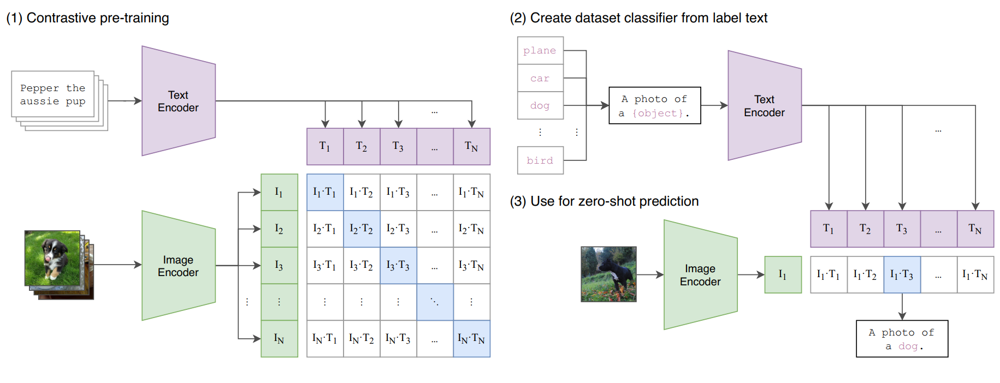
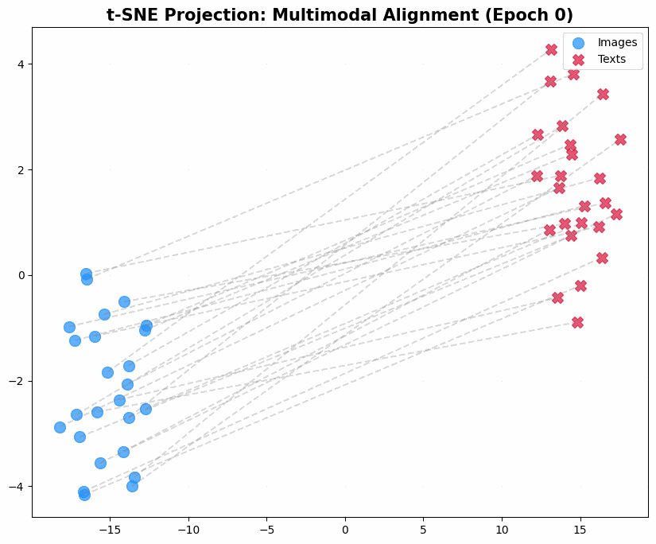
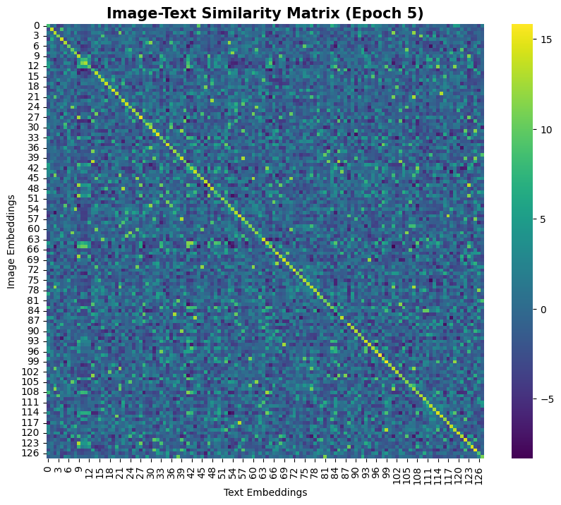
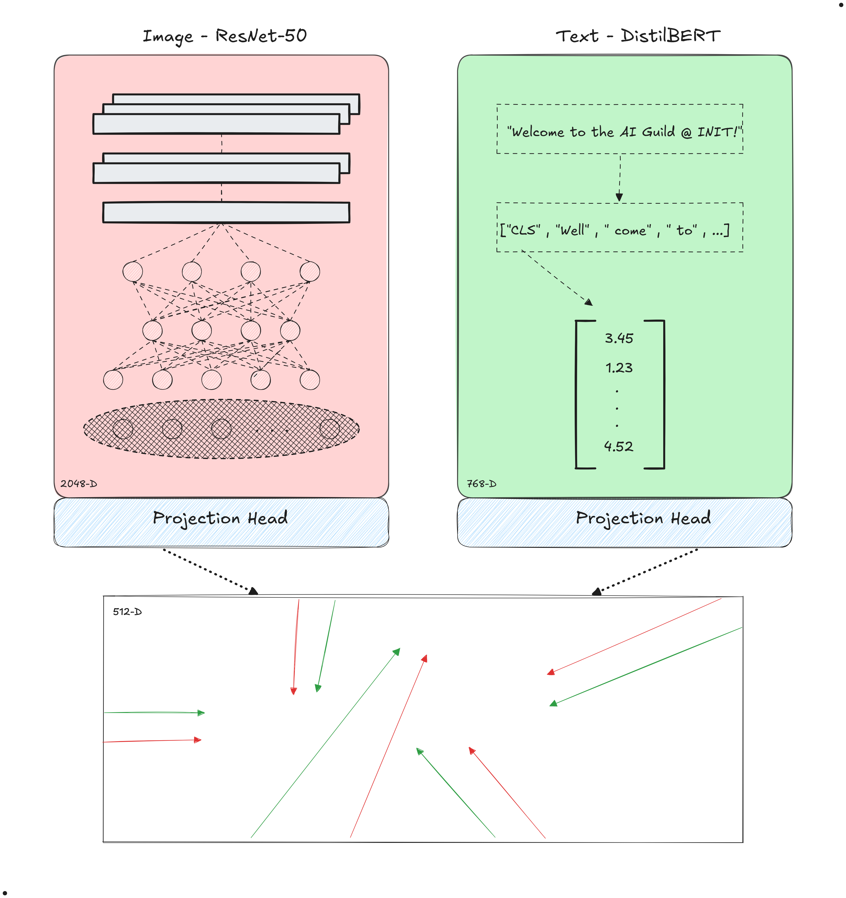
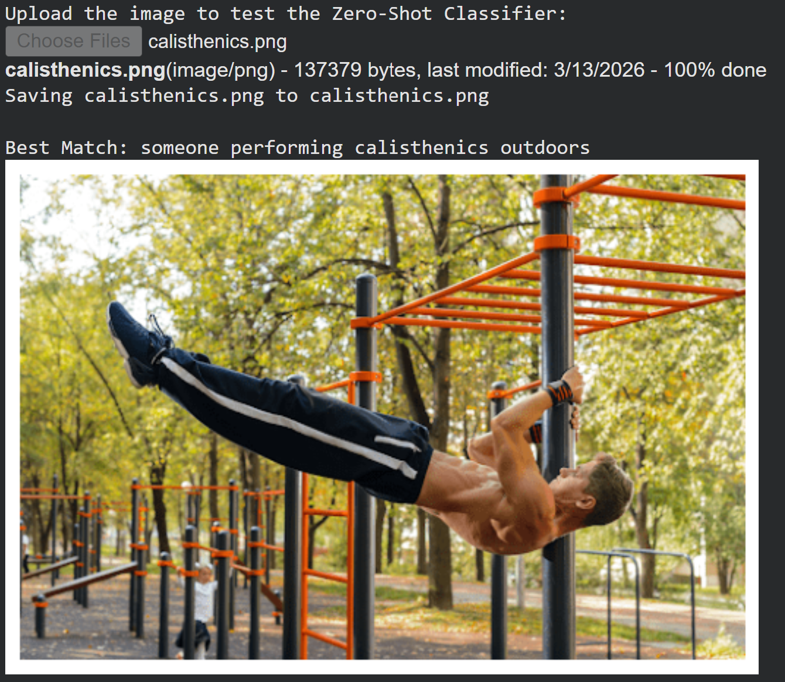
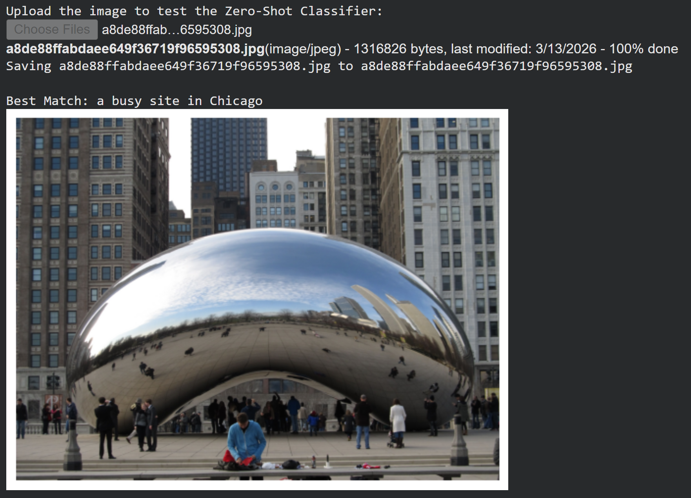
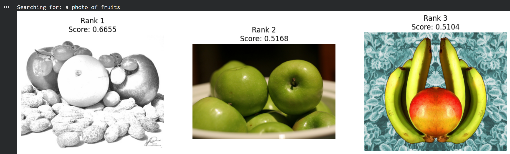
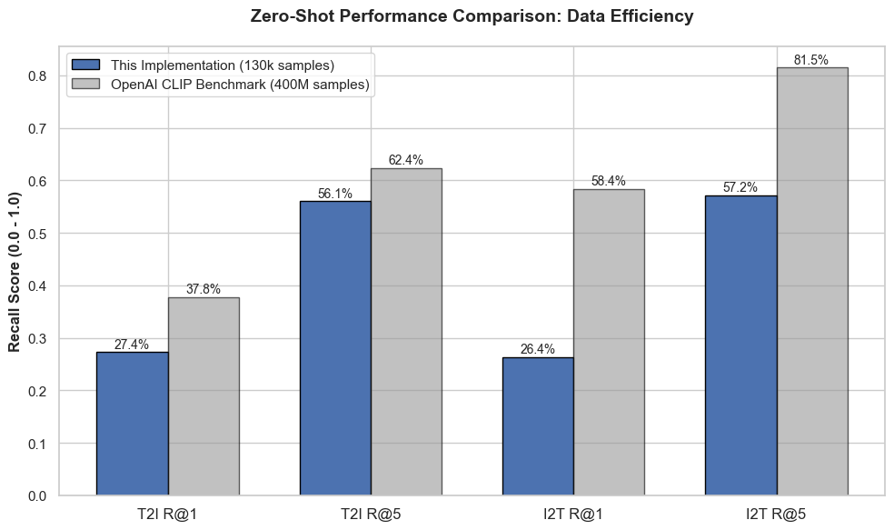

# CLIP Implementation from Scratch (Zero-Shot Image Classifier)

An implementation of **CLIP (Contrastive Language-Image Pre-Training)**, using **ResNet-50** as the image encoder and **DistilBERT** as the text encoder. Visit the Google Colab notebook ***[here](https://colab.research.google.com/drive/1Svd9Ue9LPoievhxGJjQ9_jXdTvz-Nins?usp=sharing).***

---

## Overview

This repository implements the core mechanismS of the OPENAI paper: *["Learning Transferable Visual Models From Natural Language Supervision"](https://arxiv.org/pdf/2103.00020)*.

By training on the **MS-COCO dataset**, this model learns to project images and their corresponding captions into a shared 512-dimensional embedding space. The closer the image and text are in semantic meaning, the higher their cosine similarity (or normalized dot-product).

---

## Visualizing the Alignment

The most powerful way we can see CLIP in action is by watching the latent space get organized during training.

### t-SNE Evolution

As training progresses, the "Image" dots (in Blue) and the "Text" dots (in Red) begin to cluster together.

### Similarity Matrix

The diagonal represents the "correct" image-text pairs. Our goal is to have this matrix represent an identity matrix as much as possible!

---

## Architectural Details

Following the CLIP paper:
- **Image Encoder:** ResNet-50 (pre-trained on ImageNet)
- **Text Encoder:** DistilBERT
- **Projection Head:** Linear(embed_dim , 512)
- **Temperature:** A learnable parameter to scale the logits before softmax

---

## Results

The model exhibits zero-shot capabilities, allowing to classify images into categories it was never explicitly trained on.

### Zero-Shot Classification

### Text-to-Image Retrieval

---

This implementation retained *90%* of the Recall@5 performance in Text-to-Image retrieval compared to the OpenAI.

